
<h1 align="center">基于的公交线路查询系统</h1>

## 简介
基于Spring Boot的公交线路查询系统，角色分为管理员、用户；主要功能包括公交线路查询、实时信息显示、用户反馈管理、公告管理和系统管理。该系统界面简洁，功能丰富，支持多种用户交互方式，提高查询效率。    --计算机毕业设计源码；毕设源码；java毕业设计源码

## 联系方式

<h3 align="center">获取完整代码与数据库文件 + 微信：deepguan QQ: 86050149 QQ群: 783742310</h3>

<h3 align="center">可帮忙远程部署 包运行成功！提供远程部署、修改代码、设计文档指导、代码讲解等服务！</h3>

## 功能介绍（完整见运行截图）
管理员：拥有全面的后台管理权限，包括公交线路的添加、编辑和删除，用户信息管理，以及留言建议和友情链接管理。可以查看和管理网站公告，并管理系统设置和轮播图。通过后台监控公交路线的使用情况和数据统计，以优化系统性能。

用户：主要功能包括查询公交线路、实时获取公交信息、以及站点搜索。用户可以在个人中心查看和修改个人信息及收藏路线。支持留言建议的提交和查看，以及参与在线提问互动。提供搜索功能以快速找到所需的公交线路和站点信息，助力出行规划。

## 运行截图
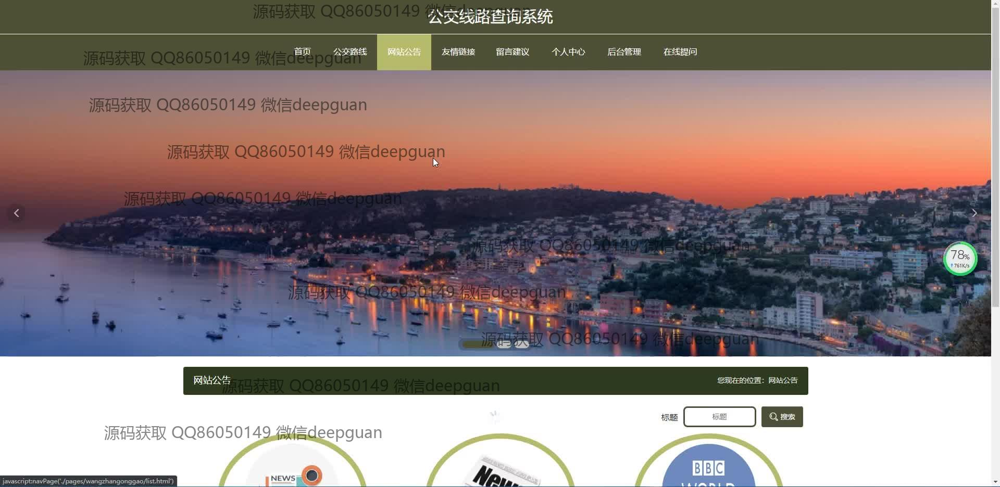
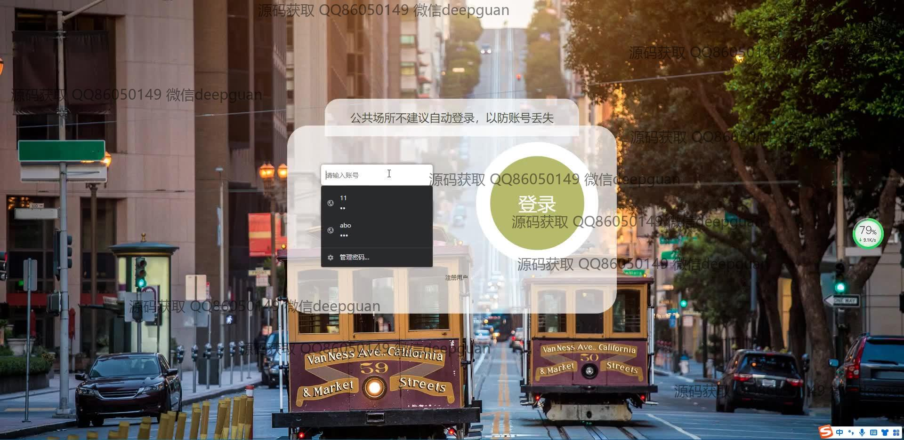
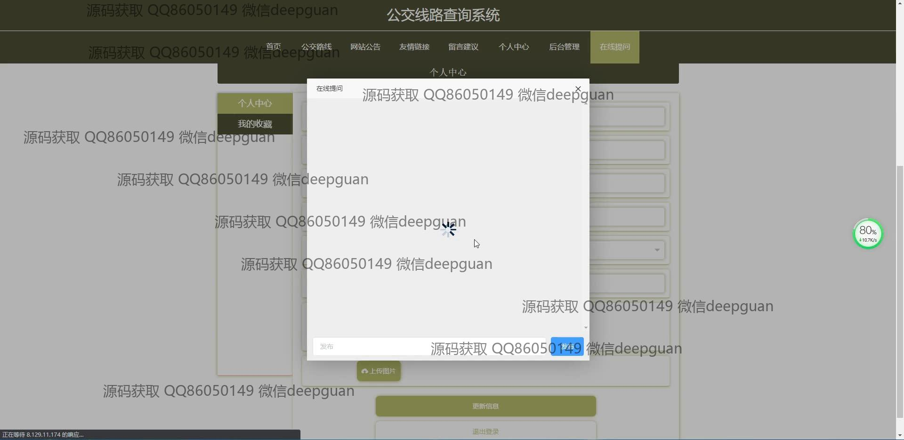

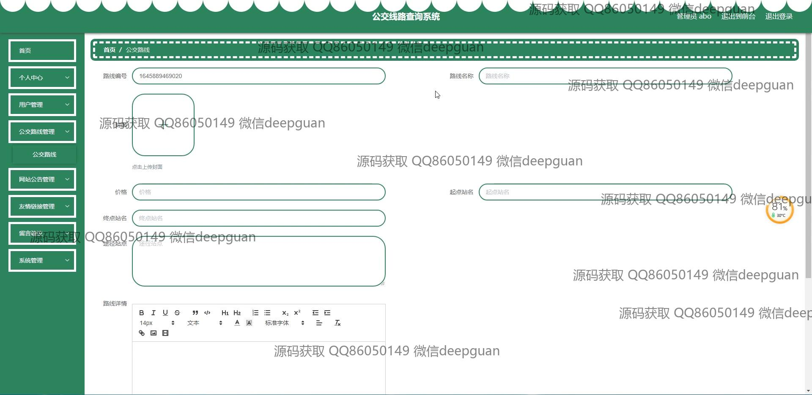
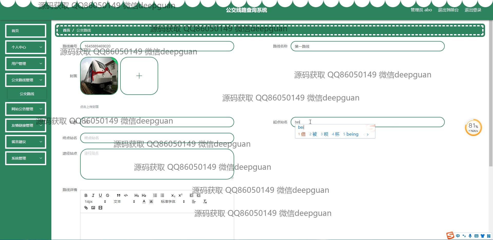
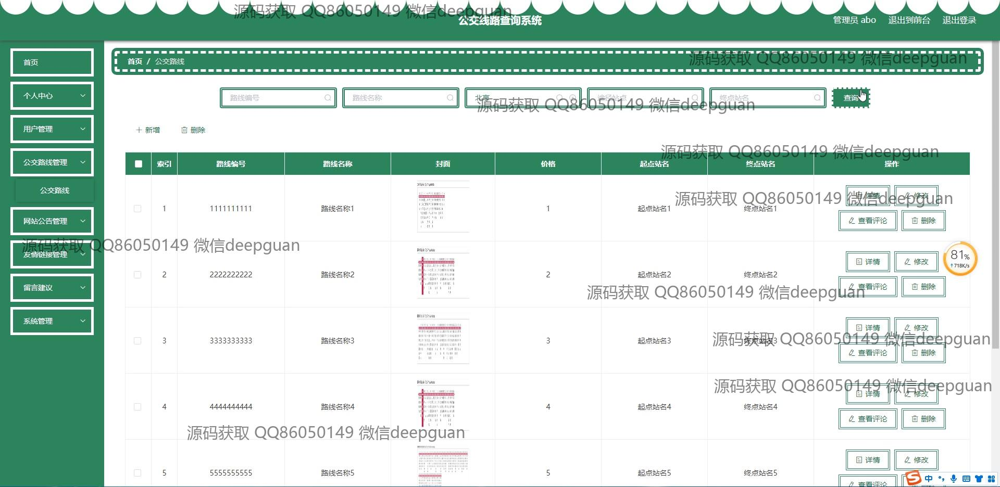
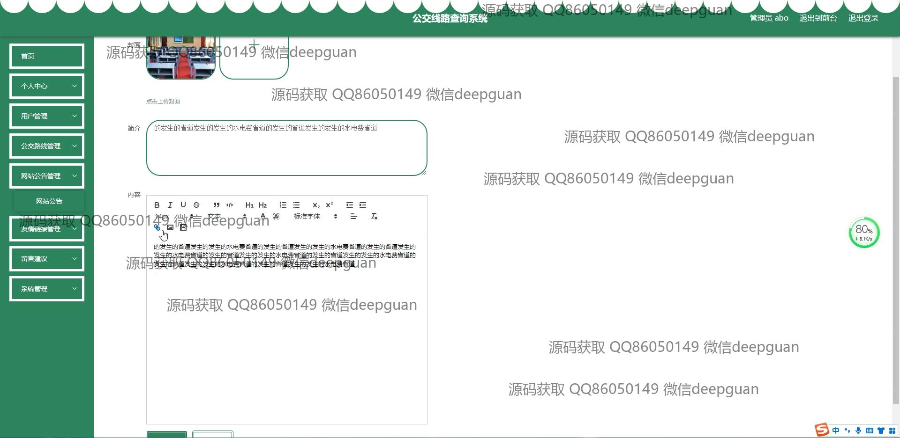
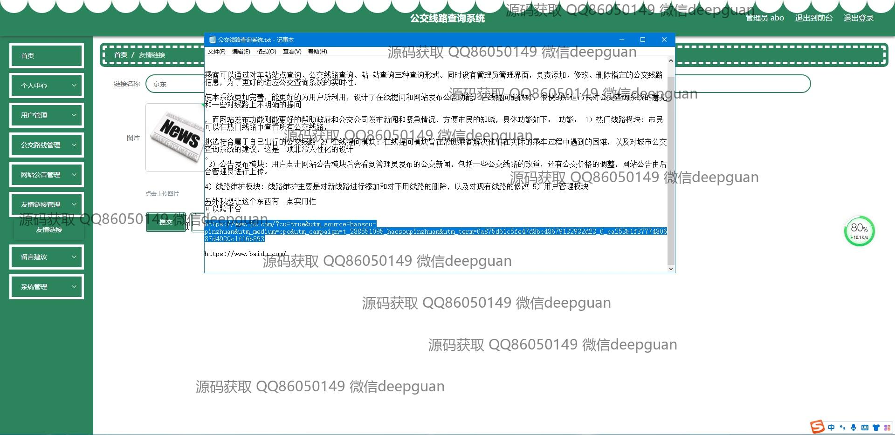
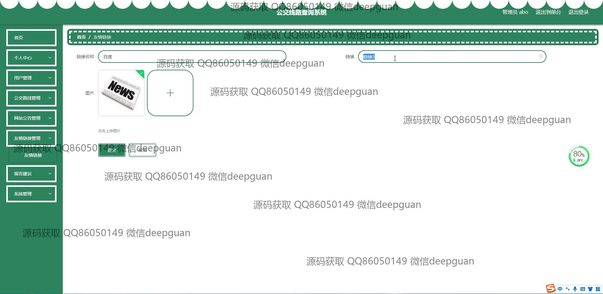

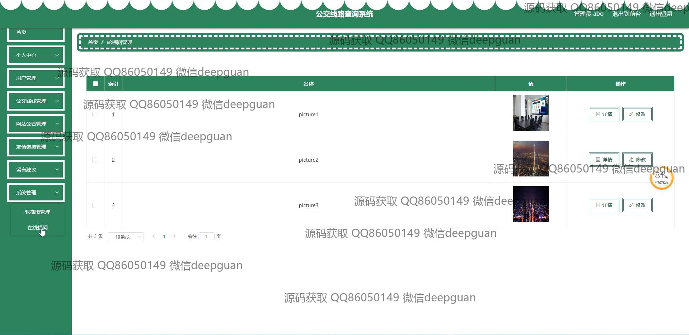

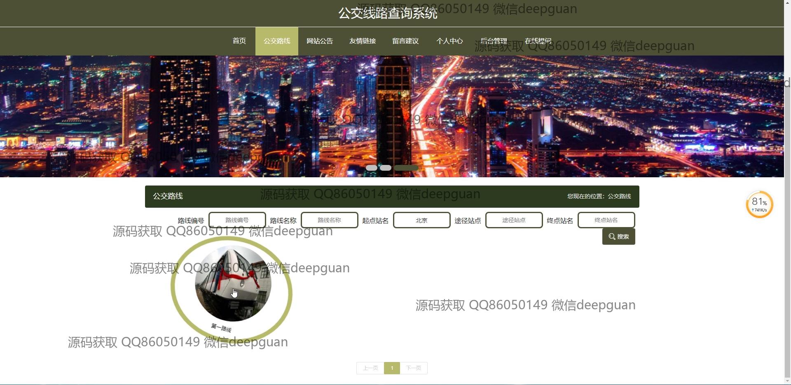
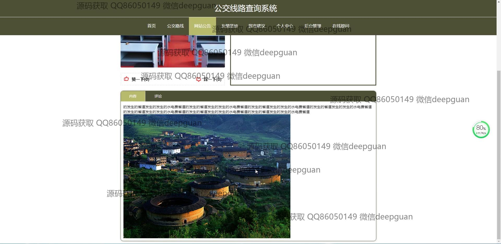

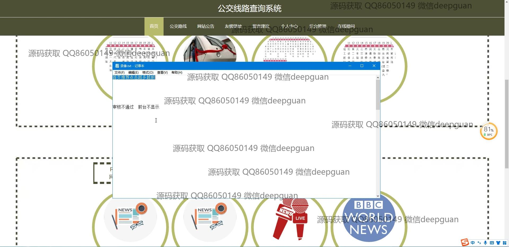
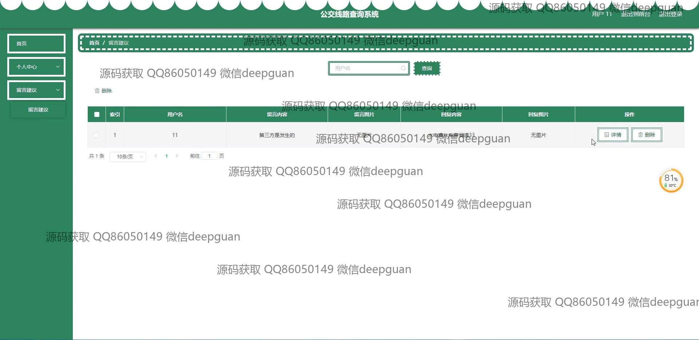

本代码来源于网络,仅供学习参考使用!

